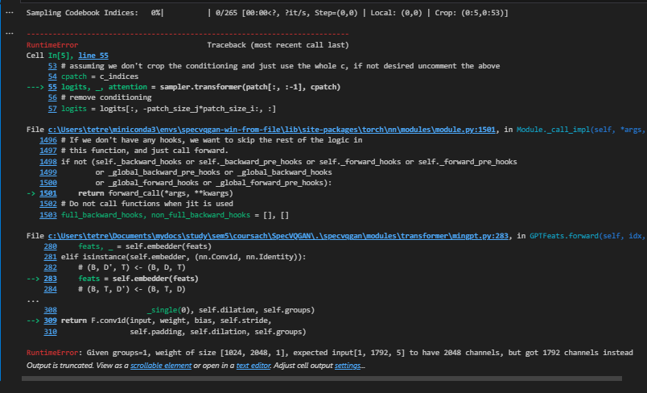

## How to use COPILOT to explain stuff?
1. Select the class (function) you want to explain
2. Type /explain the class (function) in #file:your_file

## REPLACING RESNET WITH EFFICENT NET
Models use different feature sizes. In the downloaded config file for the model (the file that's named something like: "logs/2021-07-30T21-34-25_vggsound_transformer/configs/2021-07-30T21-34-25-project.yaml") I replaced the data.feat_depth from 2048 to 1792. This fixed an error during the post transofmration

Now getting this error when sampling codebook indices

The feature downloading feature is broken. When I run the script "download_vas_features.sh" it dumps everything to the same folder and overrides the already downloaded videos because they start from video_00000 for every class.

i want to run the tranformer training from scratch to see in what format does it need the features to be

