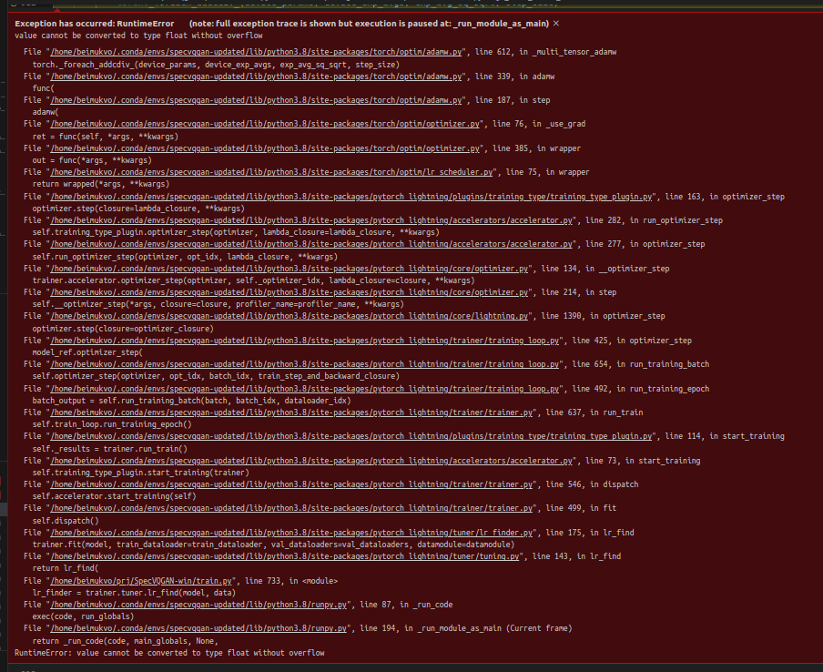
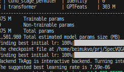
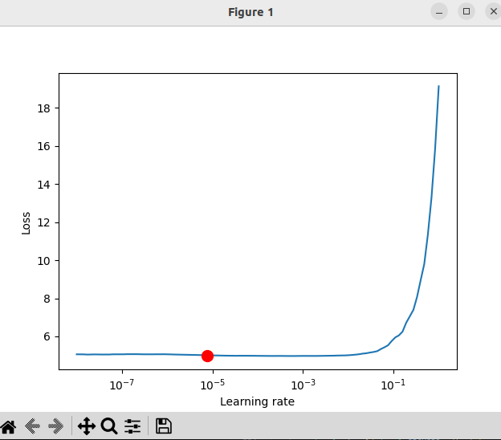
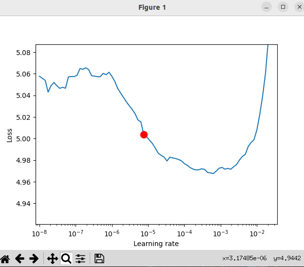

## How to use COPILOT to explain stuff?
1. Select the class (function) you want to explain
2. Type /explain the class (function) in #file:your_file

## REPLACING RESNET WITH EFFICENT NET
Models use different feature sizes. In the downloaded config file for the model (the file that's named something like: "logs/2021-07-30T21-34-25_vggsound_transformer/configs/2021-07-30T21-34-25-project.yaml") I replaced the data.feat_depth from 2048 to 1792. This fixed an error during the post transofmration

Now getting this error when sampling codebook indices


The feature downloading feature is broken. When I run the script "download_vas_features.sh" it dumps everything to the same folder and overrides the already downloaded videos because they start from video_00000 for every class.

i want to run the tranformer training from scratch to see in what format does it need the features to be


removed the early stop callback
modified the feature extraction pipeline (added efficient net, added tiling of video to 10 seconds, mentioned in docs but was not in the code)

now monitoring training loss instead of validation loss
then switched to monitoring loss instead of training loss

added auto_scale_batch_size option (although it might be useless if batch size is set to 2 in the data config idk)


you can write about turso in coursework
also write about why you selected efficient net, some graphs, comparisons etc


also i tried colab but that didn't work because it needs a lot of space


sampler.batch_size is overwriting sampler_batch_size in sampling pipeline (set the sampler.batch_size in the .job file, not in the config)
we're setting num_workers to 0 if using ddp because it can spawn too many processes and overload cpu (should still be fine according to chatgpt)


when i run the learning rate finder from pytorch it first crashes with this error:



but if i change the weight decay from 0.01 to 0.1, it works and finds this learning rate:
 


which is quite close to what was set as the base learning rate in the model. I set is as a new base learning rate. I need to check if it scales with a different batchsize


To display on tensorboard:
On slurm, launch:
```
cd prj/SpecVQGAN-win
module purge
module load Python
pip install tensorboard
pip install protobuf==4.25.3
python -m tensorboard.main --logdir=./logs/{logdir}
```

On remote desktop, launch:
ssh -L 16006:localhost:6006 {ip addr of turso login node where tensorboard is launched}